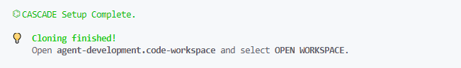
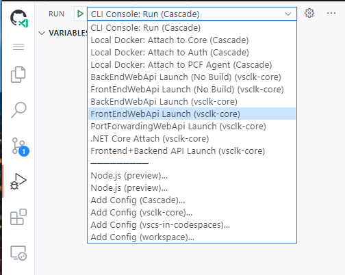
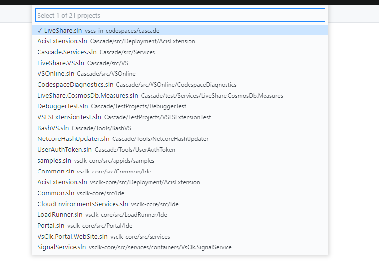
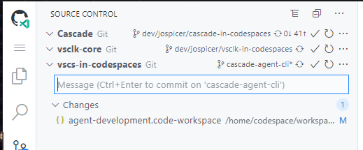
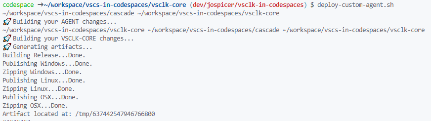
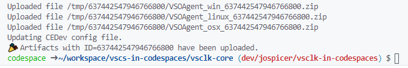

# Agent Development _in Codespaces_

> ⚠⚠ Branch is under construction.  Contact [jospicer](josh.spicer@microsoft.com) with questions. 

## Getting Started

### Setup

Please follow the [README on the codespaces-service branch](https://github.com/vsls-contrib/vscs-in-codespaces/blob/codespaces-service/README.md) to complete the individual developer setup.

Specifically, make sure to:
 1. Follow the [one-time setup section](https://github.com/vsls-contrib/vscs-in-codespaces/tree/codespaces-service#one-time-setup) 
 2. [Set](https://github.com/settings/codespaces/secrets/new) your environment variables **before creating the codespace**. 

**AFTER** the initialization script completes, open `agent-development.code-workspace` from the file explorer and select `OPEN WORKSPACE` (or click the workspace pop-up that will automatically appear). 

> You can check provisioning status with the `Codespaces: View Creation Log` vscode command. You will see the text in the following image when complete.  It takes about a minute to clone and restore both repos!
> 
> 


### Organization

This will give you a clean workspace organized like:

```
.
├── Cascade
    ├── bin
    ├── ...
└── vsclk-core
    ├── bin
    ├── ...
```

This will recursively pull in the workspace and `.vscode` config for each of the repos.  This will populate the "Run" with the relevant launch commands.



Run the VSCode command `Omnisharp: Select Project` to set VSCode's focus to the project you're working on.  Selecting a project will help omnisharp enable intellisense and other nice editor features for the code you're working on.

For agent development you may want to select the `VSOnline.sln`.

_Note: You may need to increase Omnisharp's "Project Load Timeout" to something larger than 200_



Via the source control panel you can see changes you've made in Cascade, vsclk-core, or this bootstrap repo.  Make commits how you normally for each individual repo.



The `.codespaces` directory cloned from vscs-in-codespaces is not deleted, and can still be accessed via your terminal at `~/workspace/vscs-in-codespaces/.codespaces`.  The `.codespaces` directory is added to your `$PATH`, letting you run any scripts in that directory from your terminal.

## How to...

### Run Frontend + Backend Services

Please check the README on the `codespaces-service` branch, found [here](https://github.com/vsls-contrib/vscs-in-codespaces/tree/codespaces-service#running-the-frontend-and-backend-services) for instructions and known issues.

One important known issue is that the FE and BE are run more reliably if started _without_ the debugger attached (Ctrl-F5).  See the `codespaces-services` branch for issue tracking and updates.

### Deploy a Custom Agent

You can run the `deploy-custom-agent.sh` script (on your `$PATH`, source [here](https://github.com/vsls-contrib/vscs-in-codespaces/blob/cascade-agent-cli/.codespaces/deploy-custom-agent.sh)) which will:

1. Build Cascade
2. Build Vsclk-Core
3. Generate the agent artifacts with Cascade's `DevTool.dll`
4. Upload to Azure to be used in your personal devstamp with vsclk-core's `VsoUtil.dll`.

> You may specify the **`--no-build`** flag to skip steps 1 and 2, although you'll need to have built at some point to have the `DevTool` and `VsoUtil` dlls present.


The output will look similar to this:




Your appsettings.json file in `~/CEDEev` will be updated with the correct values.
